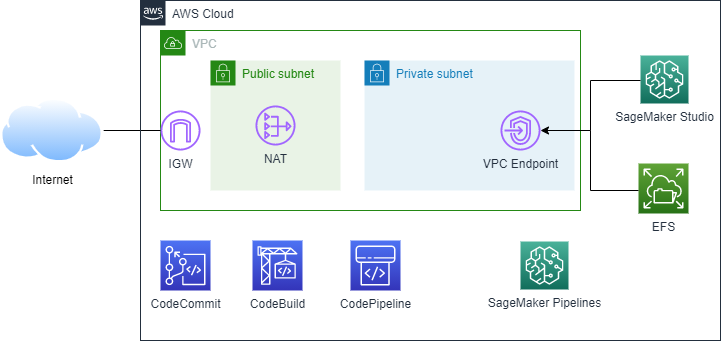
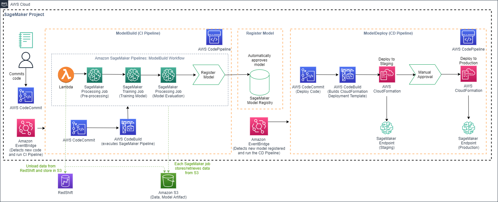

## Purpose
The purpose of this repo is to provide sample codes to create a demo to illustrate MLOps (preprocessing, training, deploying etc) with the data source coming from RedShift. Other RedShift features like RedShift Spectrum, RedShift ML are also demostrated.

Disclaimer: The focus of this demo is to showcase the above and for simplicity, full IAM permissions are assigned. In production setting, best practices like least IAM permission should be used instead.  

## Services used
Below list the AWS services used in this demo:
- SageMaker
- Code* (Part of SageMaker Pipelines)
- RedShift
- S3
- Glue
- Athena
- Secrets Manager

## Prerequisite prior to running the notebooks
Deploy the CloudFormation script `bankdm-cloudformation.yaml`. The script will do the following:
- Create a new VPC. 
- SageMaker Studio to be created and attached to the VPC (not the default option). Another way would be to allow connection from the Internet to RedShift which is not recommended. 
- Add IAM roles to SageMaker Execution role.

The following steps are to be done manually:
- Enable SageMaker jumpstart in SageMaker Studio
- Git clone this repo.
- Create a SageMaker project for building, training and deployment. 
- Overwrite the files from this repo to the modelbuild repo.

Detailed instructions are located in [**instructions.md**](instructions.md)

## High level description of the demo
Note: Please complete the prerequisite steps above first.

Notebook 01
- Create the necessary IAM roles and policies. 
- Create RedShift cluster, secret in Secret Manager and Lambda function. 

Notebook 02
- Explore the data (optional). 

Notebook 03
- Copy the CSV file to S3. Create table in Glue Data Catalog (Glue table) and reference the CSV file.
- Use Athena to query the Glue table. 
- Create RedShift schema and external table referencing the Glue table.
- Create RedShift table. Insert CSV data to RedShift using Athena. 

Notebook 04
- Once the SageMaker staging endpoint has been created, run predictions to the endpoint. 

Notebook 05
- You can also use RedShift ML to create a model directly in RedShift using SQL statements. This leverages on SageMaker AutoPilot to create another model (different from the staging SageMaker endpoint). 
- Predictions can also be done directly in RedShift using SQL statements to the RedShift ML model. For this demo, SQL statements are provided in the notebook but you can also run the same in the RedShift query editer. 

## High-level architecture diagram 

The following diagram shows the high-level architecture diagram after completing the setup.

To avoid any unexpected issues, a new VPC is created with one public subnet and one private subnet. The private subnet contains RedShift and VPC endpoints for SageMaker Studio and EFS storage. Later in the notebooks, the SageMaker Studio will access RedShift. With this architecture, all traffic will be within the VPC and RedShift does not need to be exposed to the Internet.

CodeCommit, CodeBuild, CodePipeline, Lambda and SageMaker Pipelines are used for MLOps and it is described below.

## MLOps Flow

The following diagram shows the architecture for MLOps

Once the user commits the code to CodeCommit, the following steps are run:

## Roles
There are four roles used in this demo:
- SageMaker Execution role: For SageMaker Studio to create/access resources
- RedShift role (BankDM-RedShift): For RedShift cluster to access resources and for unloading data from RedShift to S3
- Lambda execution role (BankDM-Lambda): For Lambda function to access resources
- AmazonSageMakerServiceCatalogProductsUseRole (Default role): For SageMaker Pipelines to create/access resources

## Notes
- The notebooks do not store any variables. In other words, there is no transferring of variables between notebooks. 
- If the secret already exists and you are creating the RedShift cluster again in notebook 01, the secret will not be updated to the new password. Please update the password manually in Secrets Manager. This is to prevent accidential update of the secret when you rerun the notebook while the RedShift cluster is still running. 
- The Security Group used for the RedShift and SageMaker Studio is the default one. If you are using another security group, please change the security_group_id in notebook 01.
- If you change any names such as secret/role name, you may have to edit the SageMaker Pipelines code under 'pipelines/bankdm'.

## Clean up
Notebook 06 will clean up most of the resources created automatically by other notebooks. Other areas to delete manually are:
- SageMaker Studio
- S3 buckets
- VPC (delete the CloudFormation if this method is used)
- EFS used by SageMaker Studio
- Resources created by SageMaker Pipelines like SageMaker Project. CLI has to be used to delete SageMaker Project which in turns deletes the CodePipeline (aws sagemaker delete-project --project-name BankDM)

## Possible enhancement
- Error handling
- Feature store
- Cloudformation to create other resources

## Reference
Some codes were taken from the following sources and edited from there:
- https://github.com/data-science-on-aws/workshop
- https://github.com/aws-samples/amazon-sagemaker-immersion-day
- https://aws.amazon.com/blogs/aws/amazon-redshift-ml-is-now-generally-available-use-sql-to-create-machine-learning-models-and-make-predictions-from-your-data/
- https://github.com/aws/amazon-sagemaker-examples/tree/master/sagemaker-pipelines/tabular/lambda-step