# Detailed instructions for setting up the environment

Note: This guide will setup a new VPC with a private and public subnet.

## Content
- [Create a separate VPC](#Create-a-separate-VPC)
- [Create SageMaker Studio](#Create-SageMaker-Studio)
- [Assign IAM permission](#Assign-IAM-permission)
- [Create SageMaker Studio user](#Create-SageMaker-Studio-user)
- [SageMaker Studio](#SageMaker-Studio)

## Create a separate VPC 

#### Note: For this step, either use CloudFormation to create the resources or follow the steps below to create the resources manually. The CloudFormation script is in the same folder as this file and it is named `bankdm-cloudformation.yaml`.

- Login to your AWS management console and go to VPC.
- On the left side, click on `Elastic IPs`.
- At the right side, click on `Allocate Elastic IP address`.


- Leave the settings as is and click `Allocate`.


- On the left side, click on `VPC Dashboard`.
- Click on `Launch VPC Wizard`.


- Select the second option `VPC with Public and Private Subnets` and click `Select`.


- Leave the settings as is. Under `VPC name`, enter a name of your choice. If you change the `Private subnet name`, do take note of it as you need to change it in notebook 01.


---

## Create SageMaker Studio
- In your AWS management console, go to SageMaker.
- On the left side, click on `Amazon SageMaker Studio`.
- At the `Get started` page, choose `Standard setup` and choose `AWS Identity and Access Management (IAM)`
- Click on the `Choose an IAM role` box


- `Create a new role`


- For this demo, we allow access to every S3 bucket. Click on `Create role`.


- This will create an IAM role. 


- Scrolling down, leave the `Notebook sharing configuration` and `SageMaker Projects and JumpStart` as default.
- Under `Network and storage`, choose the VPC that you have created (default is ok) and choose at least one subnet. 
- Under `Network Access for Studio`, ensure `VPC Only` is selected.
- Under `Security group(s)`, choose the security group that allows access between SageMaker Studio and RedShift. The default security group is ok.
- The screen should look like this


- Click `Submit`. If you have any error, the submit button will not work. Scroll up to check on the error. One error I encountered is that the IAM role is not selected properly and I had to reselect it again.
---

## Assign IAM permission
- While waiting, the next step is to assign additional policy to the SageMaker role.
- In your AWS management console, go to IAM.
- On the left side, click on `Roles`.
- Select the SageMaker role that was created earlier. Mine is listed below and yours will differ.


- Notice there are two policies given to this role. Click on `Attach policies`.


- Enter `iamfull` in the search box. Check the `IAMFullAccess` policy and click `Attach policy`.


- This should return back to the IAM role page. Note there are three policies given to this role now.


---

## Create SageMaker Studio user
- In your AWS management console, go to SageMaker.
- On the left side, click on `Amazon SageMaker Studio`.
- Under the `Studio Summary`, the status should show `Ready`.
- Click on `Add user`.


- Enter your desired user name or accept the default one.
- For the execution role, ensure the SageMaker role created earlier is selected.


- Click on `Submit`.
- Once the user is created, click on `Open Studio`.


## SageMaker Studio
- After a short while, you will be presented with the following screen.

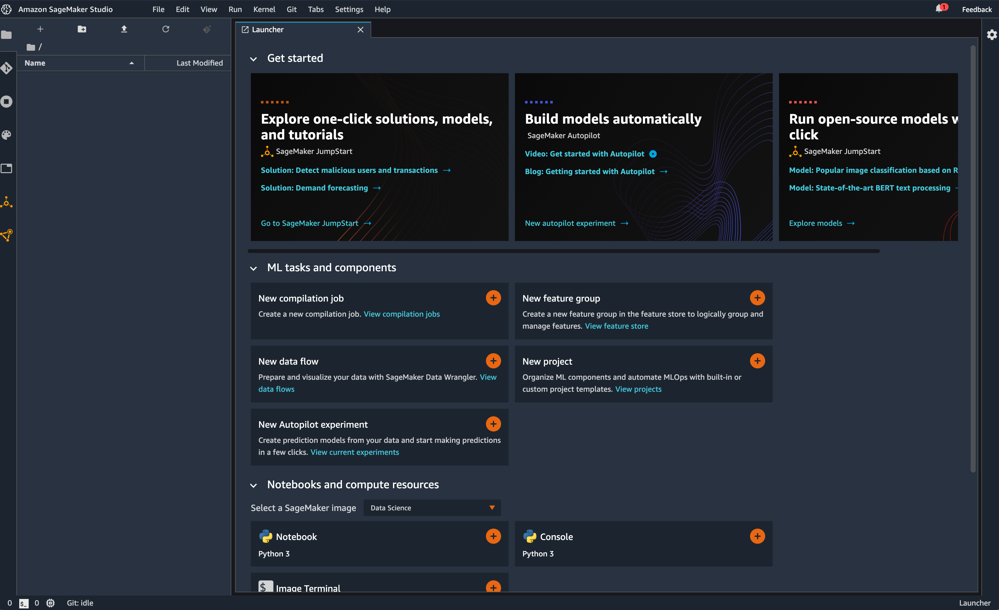

- On the left side, click on the second icon and click on `Clone a Repository`. 

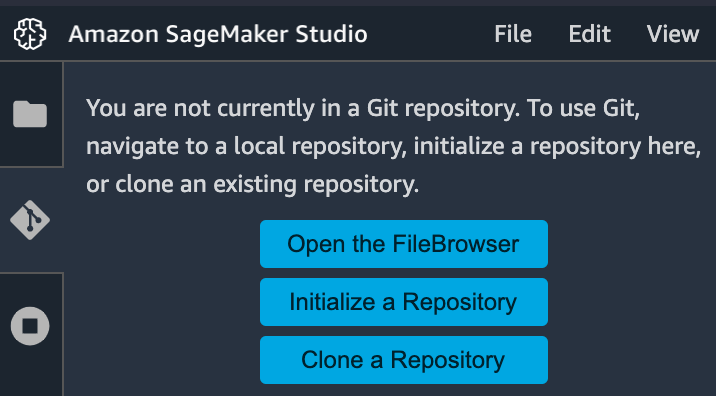

- Enter the git clone URL of this repo and click `CLONE`.

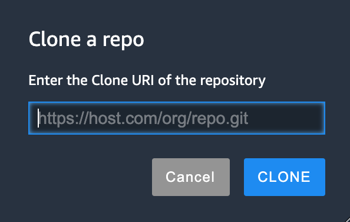

- On the left side, click on the last icon. At the menu box, select `Projects` if it is not selected.


- Click on `Create project`. A new window should pop up on the right side.
- Select the `MLOps template for model building, training and deployment` and click `Select project template`.

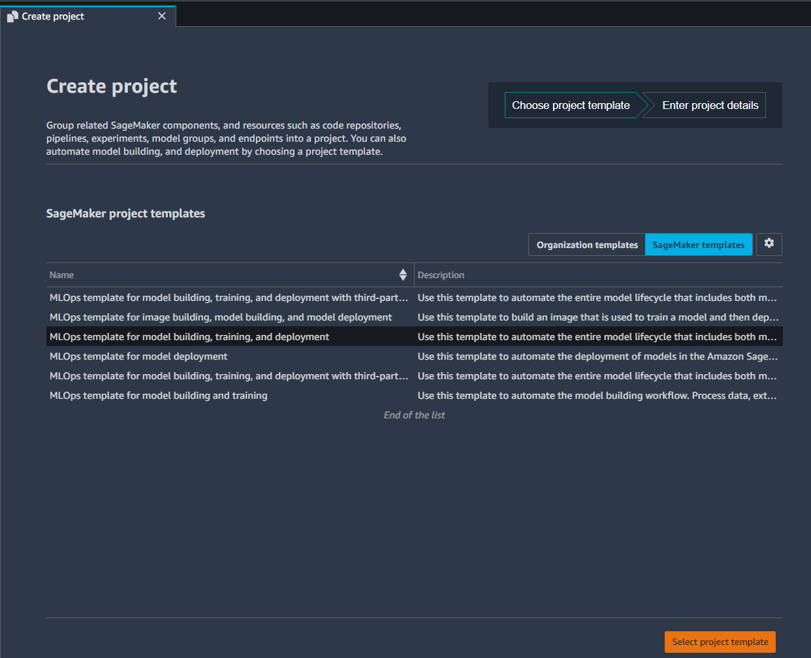

- Enter a name for the project (e.g. BankDM) and click `Create project`. The screenshots below use the name BankDemo2.

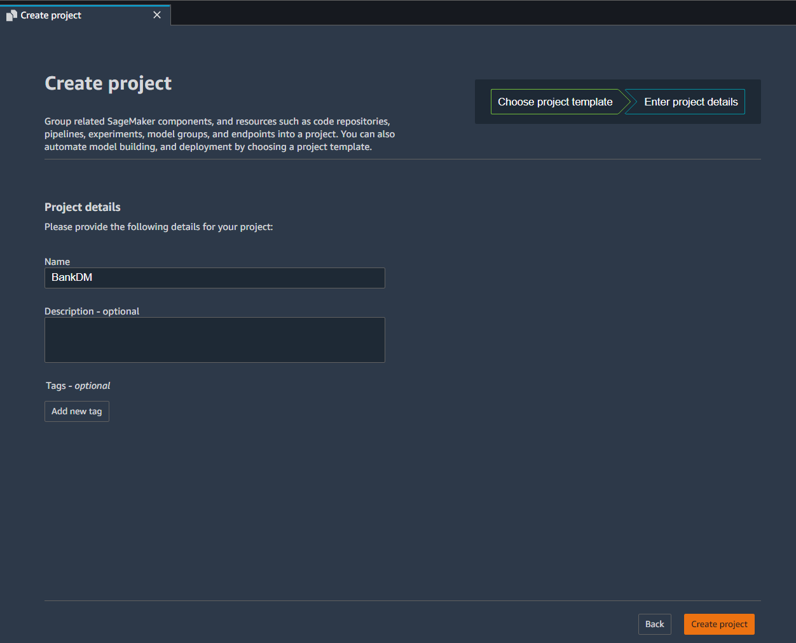

- After a while, the project is created.
- Click on the first `clone repo...`.

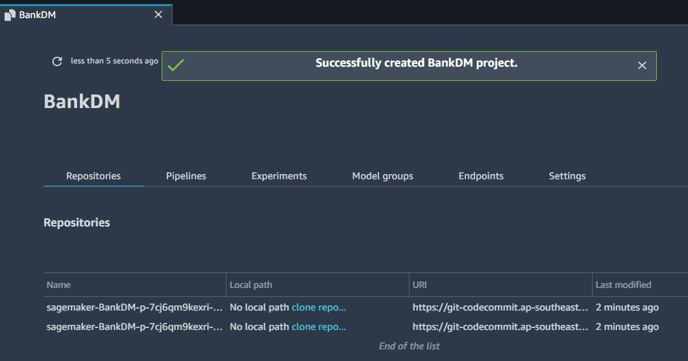

- Click on `Clone Repository` to clone the repo to the SageMaker Studio.


- Click on the second `clone repo...` and click `Clone Repository`.


- The window should look like this.


- Click on the `Local path` link beside the modelbuild repo. This will bring you to the directory.

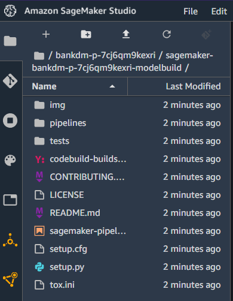

- Select all the files, right click and click `Delete`.


- Go to the repo that was clone earlier (`bankdemo-build` in my case). Your repo name may differ.
- Select all the files, right click and click `Cut`. SageMaker Studio does not allow you to copy folders but cut is ok.


- On the right side, if the BankDemo2 screen is still open, you can click on the `Local path` link beside the modelbuild repo. This will bring you to the directory.

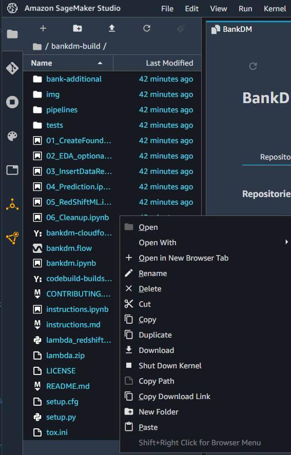

- Right click and click `Paste`.


- The files will be moved here. Do not navigate away from this folder. Note that the files in your directory may differ from the screenshot.

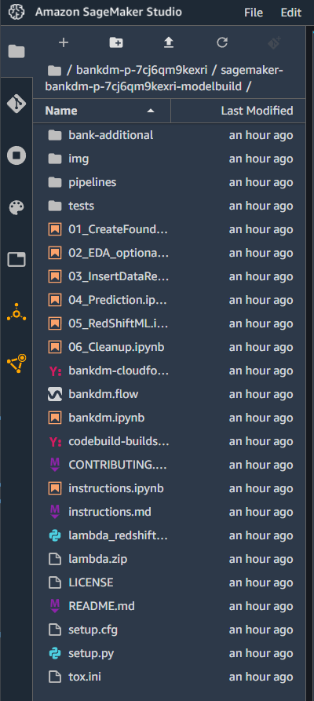

- On the left side, click on the second icon. Scroll your mouse to the right of `Changed`, select the `+` to track all files. Repeat the same for `Untracked`.

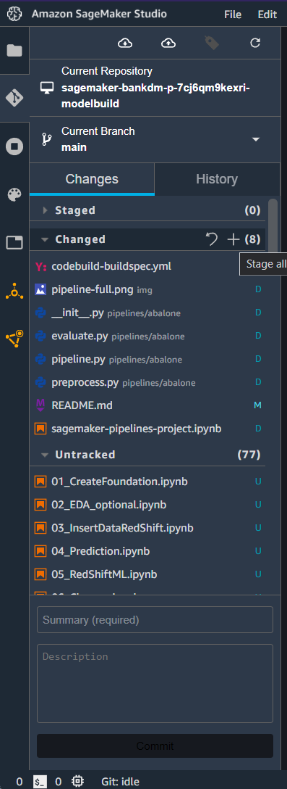

- Your window should look like this where there are no files under `Changed` and `Untracked`. The number of files shown may differ from yours.
- Enter a commit message (commit in the screenshot) and click `Commit`.


- Enter your name, email and click `OK`.


- Click on the icon with an up arrow to push the changes. This icon is above the green line in the screenshot.


- You will get the following message.

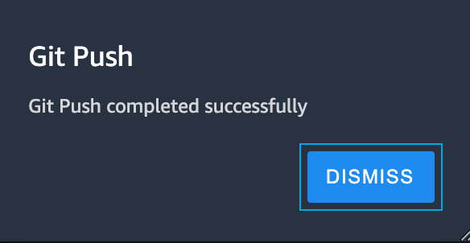

- On the right side of the screen, click on `Pipelines` tab and double click on the Pieplines shown (`BankDemo2-p-sn41sxosn3ef` in my case).

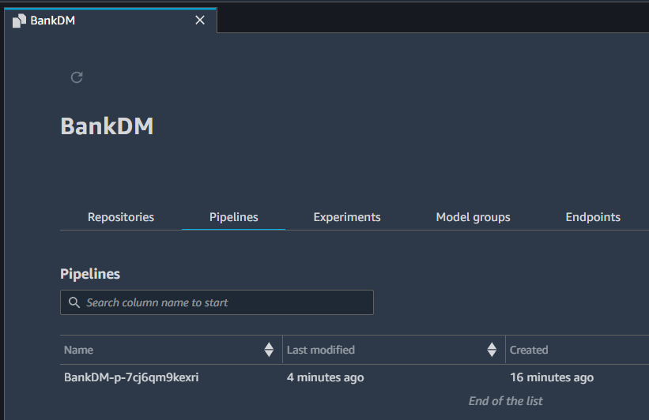

- The pipeline should automatically run after a short while as you push new codes. Do note that this pipeline will fail as you have not setup RedShift.

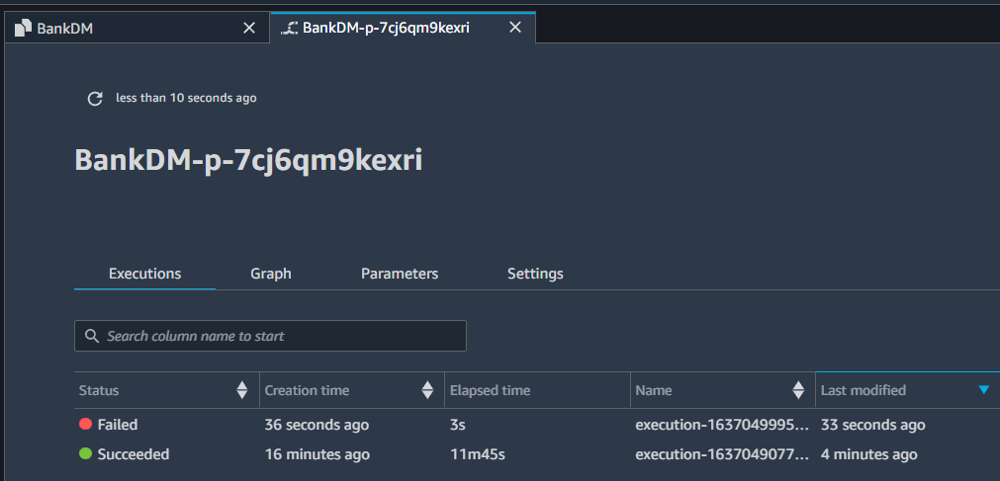

# This concludes setting up SageMaker Studio. You can now proceed to run notebook 01.


```python

```
